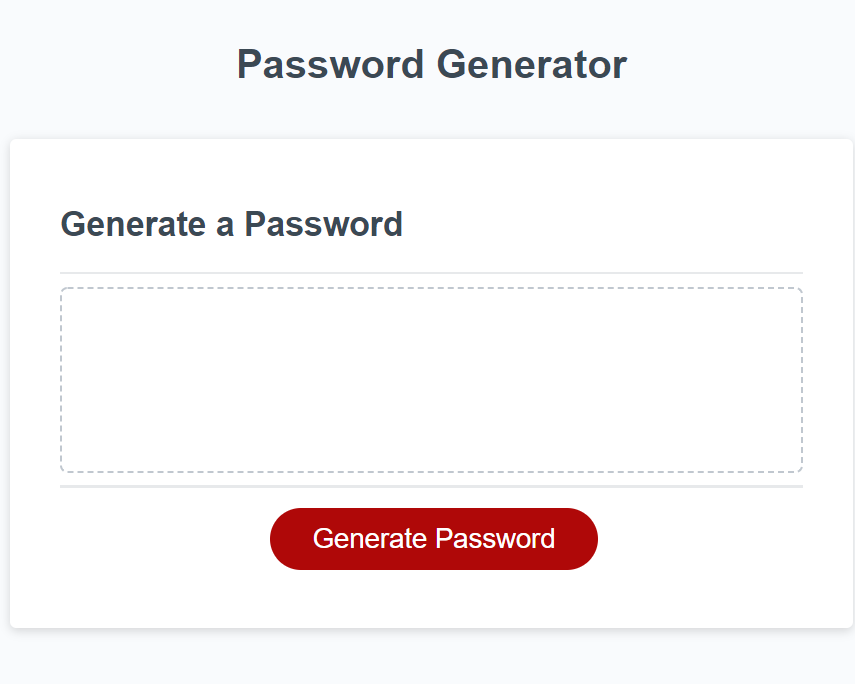

# Password-Generator
Password Generator

## Description and Requirements

This week's Challenge required me to modify starter code to create an application that enables employees to generate random passwords based on criteria that they’ve selected. This app will run in the browser and will feature dynamically updated HTML and CSS powered by JavaScript code that you write. It will have a clean and polished, responsive user interface that adapts to multiple screen sizes.

```
GIVEN I need a new, secure password
WHEN I click the button to generate a password
THEN I am presented with a series of prompts for password criteria
<!-- Done -->

WHEN prompted for password criteria
THEN I select which criteria to include in the password
<!-- Done -->

WHEN prompted for the length of the password
THEN I choose a length of at least 8 characters and no more than 128 characters
<!-- Done -->

WHEN asked for character types to include in the password
THEN I confirm whether or not to include lowercase, uppercase, numeric, and/or special characters
<!-- Done -->

WHEN I answer each prompt
THEN my input should be validated and at least one character type should be selected
<!-- Done -->

WHEN all prompts are answered
THEN a password is generated that matches the selected criteria
<!-- Done -->

WHEN the password is generated
THEN the password is either displayed in an alert or written to the page
<!-- The functions are working, but can't seem to get anything to display in the password box given by the cloned code, used an alert to display instead. -->


```

## Updates following grading

Function was not actually following minimum and maximum number set by form, updated function to bring to minimum and maximum number if outside of number value. 

Grading indicated that a form was not an appropriate prompt to have criteria input, it was asking for individual alerts instead. I don't want to alter the code that I initially presented too far, so I've simply ensured the numeric values for the time being. 

I would have used the confirm() method to ensure each individual criteria for the lower, upper, numeric, and special character values. prompt() methoud would be best to allow an entered value as well. Now that I understand the verbiage more for the requirements of the challenge, I understand why the form wasn't the way to get the selected criteria. 

### Mock-Up

The following image shows the web application's appearance and functionality:




#### Live Link

 https://halliemestas.github.io/Password-Generator/ 
